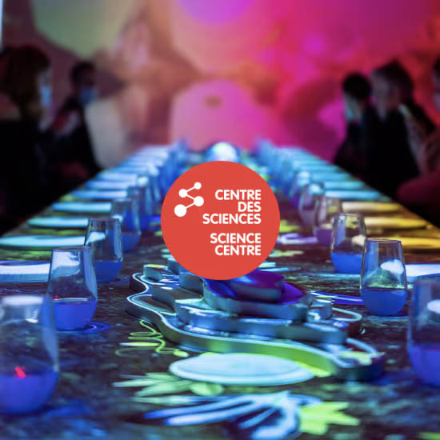
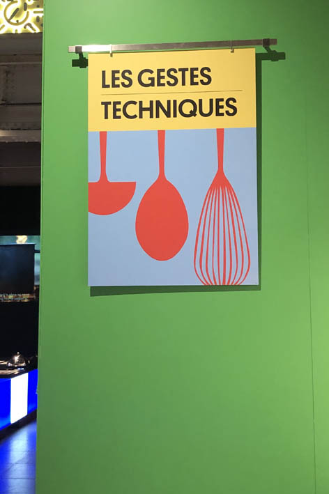
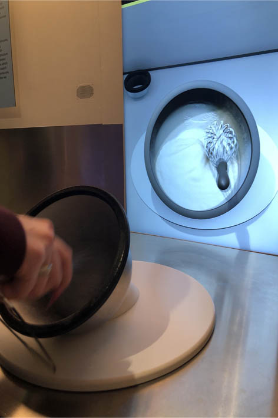
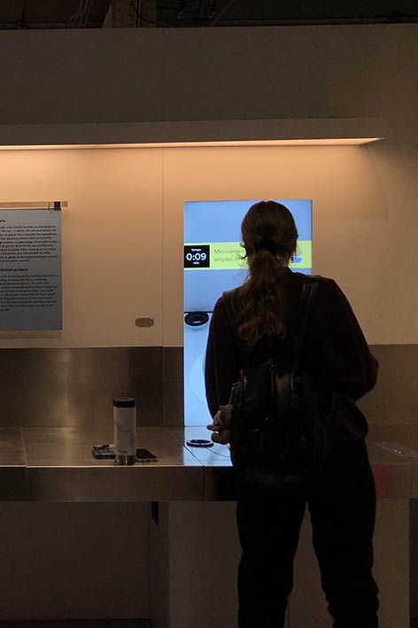

# Banquet-Centre des sciences 

## Informations sur le banquet  
Le banquet s'agit d'Une exposition temporaire, qui a débuter le 16 mai 2024 et qui fini le 16 mars 2025. C'est une experience Immersive.
J'ai visité ce centre le 31 janvier 2024 et j'ai beaucoup apprécié. J'ai passer environs 2 heures à explorer et a lire et comprendre chaque station.
Le sujet de mon banquet ou plus précisement celui de l'exposition troune autour de la gastronomie.
En effet, la gastronomie est l'art de déguster et d'apprécier les mets. C'est une science d'apprentissage culinaire et l'exposition vise 
à visualiser ceci. Le but de l'exposition d'une certaine manière est de visualiser et démontrer l'aspect artistique est scientifique aux visiteurs.
Que vous sachiez déja ou pas les techniques culinaire, s'enrichire en avantage sur la cuisine ou sur la technologie derriere les banquets reste une
découverte. Grâce au dispositifs présenté, il ya une interactivité pour donner une expérience pratique aux visiteurs.

 

# Les Gestes Techniques

## Ma banquise
Le dispositif que j'ai choisi s'appelle les gestes techniques, mais celui qui ma intéresser c'est le fouet-la crème fouettée.
Le but de ma banquise c'est de se bien servir d’un fouet. Apprendre les gestes techniques. Cette instalation dure environ 4 minutes, 1 minutes d'explication et 3 minutes de mise en épreuve.
L'exercice constitue d'Une table avec lequelle il y a un bol et un fouet. L'ecran en face n'est pas intéractif, plutot une source de diffusion. Il ya deux haut-parleurs de chaque côter de l'ecran et un bouton de démarrage.

## Description
Pour le mode d'utulisation, il y’a un écran devant l’utilisateur et celui-ci appuie sur un bouton ‘débuter’ pour que le système recommence l’expérience de nouveau. Après l'Affichage d'une courte vidéo sur comment fouetter de la crème,
l'utulisateur est invité à essayer l'activitée.Lorsque le visiteur prend le fouet et le met dans le bol, les contours de ce bol a une bordure noire. Celle si contient des capteurs de plusieurs types, ils enregistrent et détecte le mouvement de l’utilisateur et le traduit à l’écran en l’affichant en temps réel. 
Il y a un chronomètre afficher à l’écran, lorsque le temps est fini, il y a l’affichement du niveau du visiteur, d’une a cinq étoiles. Le système calcul cela grâces au mouvement enregistrer.

## Multimédia
Pour ce qui est de la technologie, la banquise est montée a partir de : Écrans interactifs, Capteurs de mouvement, Réalité augmentée, Feedback haptique.
Après avoir fait mes recherches, j'ai constatée que chaque pièce a son comportement. Par exemple, il ya des gyroscopes, qui mesurent la vitesse angulaire. Il ya aussi des Capteurs de proximité,ces capteurs détectent la présence d'un objet sans contact physique.
Une autre Information que je trouve pertinante est celle des Capteurs de force, ils mesurent la force appliquée par l'utilisateur sur le fouet, et etc..

## Crédits
L'Ingénieur multimédia est le seul qui semble avoir participé dans l'equipement physique. J'ai fait mes recherches et il s'appelle Philip Herpin

