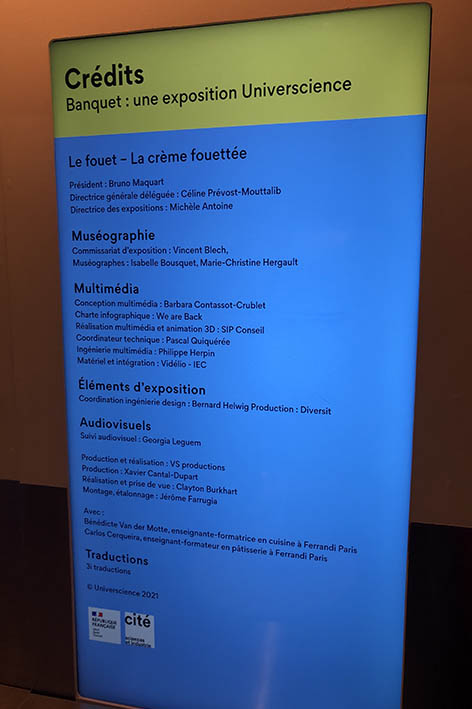

# Banquet-Centre des sciences 

## Informations sur le banquet  
Le banquet s'agit d'Une exposition temporaire, qui a débuter le 16 mai 2024 et qui fini le 16 mars 2025. C'est une éxperience Immersive.
J'ai visité ce centre le 31 janvier 2024 et j'ai beaucoup apprécié. J'ai passé environ deux heures à explorer et à lire et comprendre chaque station.
Le sujet de mon banquet, ou plus précisément celui de l'exposition, tourne autour de la gastronomie.
En effet, la gastronomie est l'art de déguster et d'apprécier les mets. C'est une science d'apprentissage culinaire, et l'exposition vise à visualiser ceci.
Le but de l'exposition, d'une certaine manière, est de visualiser et de démontrer l'aspect artistique et scientifique aux visiteurs.
Que vous sachiez déjà ou non les techniques culinaires, s'enrichir en avantage sur la cuisine ou sur la technologie derrière les banquets reste une découverte.
Grâce aux dispositifs présentés, il y a une interactivité pour donner une expérience pratique aux visiteurs.

 

# Les Gestes Techniques

## Ma banquise
Le dispositif que j'ai choisi s'appelle "Les gestes techniques", mais celui qui m'a intéressé, c'est "Le fouet – la crème fouettée".
Le but de ma banquise est de bien se servir d’un fouet et d'apprendre les gestes techniques.
Cette installation dure environ 4 minutes : 1 minute d'explication et 3 minutes de mise à l'épreuve.
L'exercice se compose d'une table sur laquelle il y a un bol et un fouet.
L'écran en face n'est pas interactif, mais plutôt une source de diffusion.
Il y a deux haut-parleurs de chaque côté de l'écran, ainsi qu'un bouton de démarrage.

## Description
Pour le mode d'utilisation, il y a un écran devant l’utilisateur, et celui-ci appuie sur un bouton "Débuter" pour que le système relance l’expérience.
Après l'affichage d'une courte vidéo sur la façon de fouetter de la crème,
l'utilisateur est invité à essayer l'activité. Lorsque le visiteur prend le fouet et le met dans le bol, les contours de ce bol ont une bordure noire. Celle-ci contient des capteurs de plusieurs types : ils enregistrent et détectent le mouvement de l’utilisateur et le traduisent à l’écran en l’affichant en temps réel.
Il y a un chronomètre affiché à l’écran. Lorsque le temps est écoulé, le niveau du visiteur s'affiche, de une à cinq étoiles.
Le système calcule cela grâce aux mouvements enregistrés.

## Multimédia
Pour ce qui est de la technologie, la banquise est montée à partir de : écrans interactifs, capteurs de mouvement, réalité augmentée, et feedback haptique.
Après avoir fait mes recherches, j'ai constaté que chaque pièce a son comportement. Par exemple, il y a des gyroscopes, qui mesurent la vitesse angulaire.
Il y a aussi des capteurs de proximité : ces capteurs détectent la présence d'un objet sans contact physique.
Une autre information que je trouve pertinente est celle des capteurs de force : ils mesurent la force appliquée par l'utilisateur sur le fouet, etc.

## Crédits
L'ingénieur multimédia est le seul qui semble avoir participé à l’équipement physique. J'ai fait mes recherches et il s'appelle Philippe Herpin. Son travail consiste à concevoir et intégrer des éléments multimédias pour créer des expériences interactives et éducatives.Il a participé et a réalisé plusieurs projets multimédias hors du Québec :**"Cerveau : de la suite dans les idées"** - Exposition permanente à la Cité des sciences et de l'industrie, Paris.
**"Mille milliards de fourmis"** - Exposition au Palais de la Découverte, Paris. Il a contribué à la recherche et au développement multimédia pour cette exposition.
**"Testez vos lobes frontaux"** - Exposition "Le cerveau intime" à la Cité des sciences et de l'industrie, Paris, impliqué dans l'adaptation multimédia.

# Mon Opinion
Selon moi, j’ai choisi d’étudier ce dispositif puisqu’il fait partie de ceux que j’ai appréciés lors de cette visite. Il semblait être à l’entrée, et le nombre de personnes qui voulaient faire cette activité m’a encouragé à l’explorer.
Le concept est intéressant puisqu’il s’agit d’un professionnel qui apprend au visiteur des techniques culinaires.
La crème à fouetter était pour moi une expérience amusante : savoir l’angle parfait pour fouetter la crème, la vitesse appliquée et le temps nécessaire pour qu’au final, je reçoive le résultat de mes efforts et de ma technique.
Ceci me semble être comme un jeu vidéo éducatif. La technologie derrière est impressionnante avec les capteurs multiples qui détectent mon mouvement précis.
J’ai apprécié, et je trouve que le fait que le dispositif encourage les visiteurs à le fréquenter, principalement à cause de son aspect compétitif, est un point que je prends en note.

## Élements moins appreciés
J’aurais aimé que le côté visuel soit développé. Sur l’écran, notre progrès est affiché d’une certaine manière, mais la crème en tant que telle, représentée dans le bol, ne semble pas changer. Elle reste dans son état liquide, même s’il semble que nous avons "réussi" à la former. J’aurais aimé un côté plus réaliste dans l’affichage.

# Resources
<https://www.centredessciencesdemontreal.com/sites/default/files/inline-files/cp-expo-banquet.pdf>
<https://www.centredessciencesdemontreal.com/exposition-temporaire/l-exposition-interactive-banquet>
<https://www.xjcsensor.com/fr/multi-axis-sensors-for-complex-robot-interactions-guide/>
<https://performance-tpe.fr/les-12-types-de-capteurs-%E2%81%9A-leurs-caracteristiques-et-fonctions/?form=MG0AV3>
<https://www.cite-sciences.fr/au-programme/expos-permanentes/expos-permanentes-dexplora/cerveau/jeu/index.php?copyright=1&form=MG0AV3>
<https://www.palais-decouverte.fr/fr/fr/ressources/expositions-passees/mille-milliards-de-fourmis-cette-exposition-est-terminee/site-vitrine-de-lexposition-mille-milliards-de-fourmis-exposition-terminee/generique/?form=MG0AV3>

