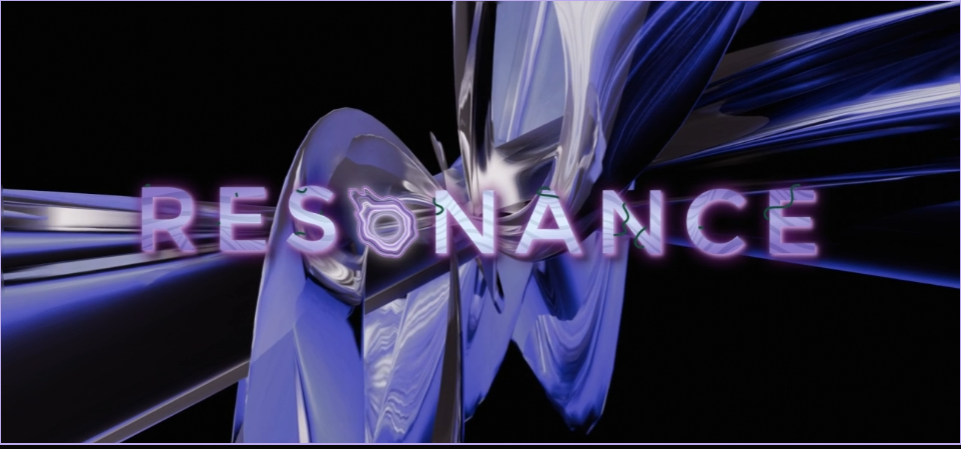
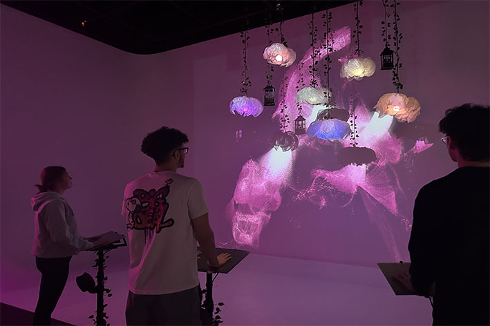
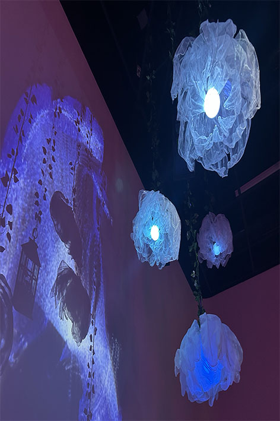
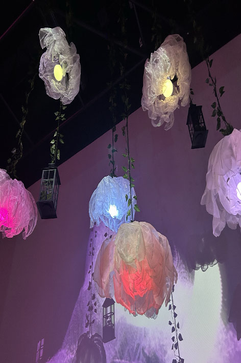
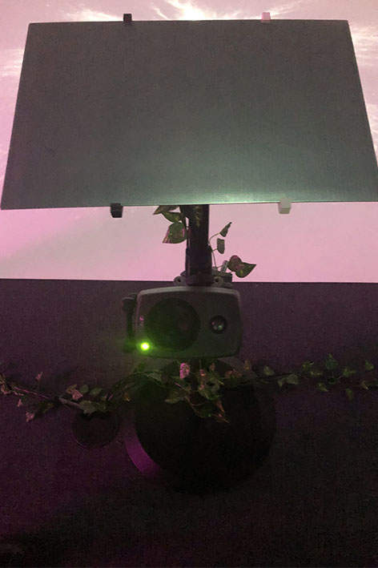
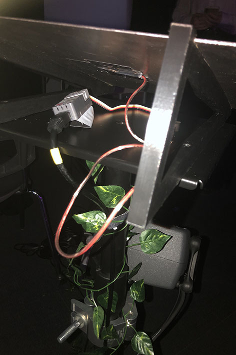
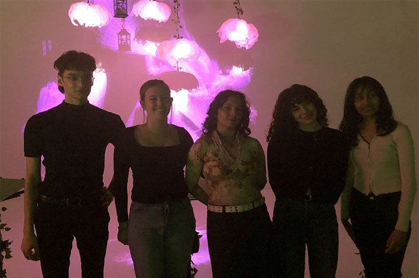

# Exposition des finissants en TIM

## Résonance
Le nom de l'exposition étant Résonance, elle débute le 17 mars jusqu'au 21 mars 2025. Cette exposition est temporaire puisqu'elle est située dans un cégep et non un musée. J'ai visité le musée le 18 mars 2025 et j'ai passé environ 1 heure à visiter chaque installation. Le sujet tourne autour du multimédia, qui est le programme que j'étudie actuellement. L'installation qui m'a intéressée le plus est Luminatura, qui est une installation interactive conçue par des étudiants du Cégep de Montmorency. L'exposition LumiNatura est une installation interactive qui fusionne la nature et la technologie en utilisant la capacitance pour modifier la lumière et le son en fonction de la présence et du toucher des utilisateurs.

# Luminatura

## Experience de l'utulisation

### Entrée dans l’espace :
Lorsque l'utilisateur pénètre dans la salle, il est accueilli par un environnement immersif avec des elements comme des lanternes, d'ampoules suspendues, de vignes décoratives et d'une projection sur le sol. L'atmosphère est paisible, avec une lumière douce et des sons en fond.

### Exploration et interaction avec les plaques métalliques :
L'utilisateur aperçoit trois plaques métalliques et décide d’interagir avec l'une d’elles. Un capteur de capacitance détecte sa présence et ajuste la lumière et le son en fonction de son interaction.

### Expérience multi-utilisateurs :
Quand un deuxième utilisateur entre et interagit avec une autre plaque, les effets lumineux et sonores fusionnent, créant une véritable connexion entre les utilisateurs. Et si un troisième utilisateur fait son entrée, les effets deviennent encore plus dynamiques, intensifiant l'ambiance.

### Départ et retour au mode veille : 
Dès que tous les utilisateurs quittent, l’installation passe en mode veille, avec des lumières moins colorés et des sons apaisés, prête à accueillir de nouvelles interactions.

## Multimédia

Le budget qui a été fourni par le Cégep pour les étudiants était de 500 $. Voici le matériel qu'ils ont utilisé.

### Matériel
Plaques métalliques (capteurs de capacitance),PC avec GPU dédié (gestion globale),Microcontrôleurs (Arduino, ESP32, M5 Stack Atom),Projecteur haute résolution (diffusion vidéo),Haut-parleurs et cartes son multi-canaux (audio),Éclairage DMX et LED adressables (gestion lumineuse). Ces outils permettent de créer une interaction immersive entre l’utilisateur, la lumière et le son.
### Logiciels
Logiciels :TouchDesigner (projections), Max (audio et ambiance),Reaper (montage sonore),Arduino (capacitance),LogData (liaison des systèmes),QLC+ (gestion des lumières)

## Credits

### Les membres participants
**Audrey Dandurand** est la directrice audiovisuelle et gestionnaire du projet LumiNatura. Elle est responsable de la gestion des aspects audiovisuels de l'installation, ce qui inclut la coordination des éléments sonores et visuels, afin de créer une expérience immersive cohérente et engageante pour les utilisateurs. **Camilia Bouatmani**, qui est la directrice artistique du projet LumiNatura. Elle est responsable de la vision créative et du design artistique de l'installation, dirigeant l'aspect visuel et esthétique de l'œuvre. **Ihab  Mouhajer** développeur interactif du projet LumiNatura. Il est responsable du développement des interactions technologiques au sein de l'installation, en particulier en ce qui concerne l'aspect interactif de l'œuvre, où les utilisateurs influencent les éléments lumineux et sonores par leur présence et leurs gestes. **Justine Rousseau** est programmeuse et coordonnatrice des médias pour le projet LumiNatura. Elle est responsable de la gestion des aspects techniques liés aux médias, ce qui inclut probablement la programmation et la coordination des éléments audiovisuels de l'installation. **Prethiah Rajaratnam** programmeuse et administratrice du projet LumiNatura. Elle est responsable de la gestion technique et administrative, contribuant à l'organisation et à l'exécution du projet dans son ensemble.

## Mon Opinion personelle
Selon moi, l’exposition que j’ai préférée et celle que j’ai trouvée visuellement la plus captivante est LumiNatura. Le concept derrière qui est de créer des bruits et des lumières , en fonction du nombre de personnes participant à la dispositif et des réactions variées de chaque plaque métallique m’intéresse beaucoup. Je trouve aussi que leur idée de mêler la technologie à la nature pour créer cette ambiance fonctionne bien. En effet, l’idée derrière est mise en œuvre parfaitement. L’utilisation de la technologie des capteurs, qui détectent les particules électriques provenant du corps sur la plaque métallique, est un concept original. D’après Prethiah Rajaratnam, elle affirme que chaque individu possède une charge énergétique différente. Moins il y a de charge, moins les illustrations des fontaines de fleurs sont visibles. C’est avec l’idée de regrouper plusieurs personnes sur chaque plaque pour pouvoir maximiser la capacité de visibilité de chaque chute colorée, grâce à un regroupement de particules électriques par plaque.

## Éléments pas apprécier
Le seul défaut que j’ai trouvé, c’est par rapport à l’affichage sur le plancher. Je pense que le fait que les trois panneaux soient devant et cachent l’espace de cette projection nuit à l’expérience complète. C’est-à-dire que les panneaux devraient être un peu plus en arrière pour permettre à l’utilisateur de remarquer la projection. D’après mon expérience, cela m’a pris 7 minutes pour réaliser la projection au sol. Sinon, le projet est un succès.

## Ressources
<https://miaou-mafia.github.io/projet-luminatura/#/>
<https://www.arduino.cc/>
<https://fr.wikipedia.org/wiki/ESP32?utm_source=chatgpt.com>

