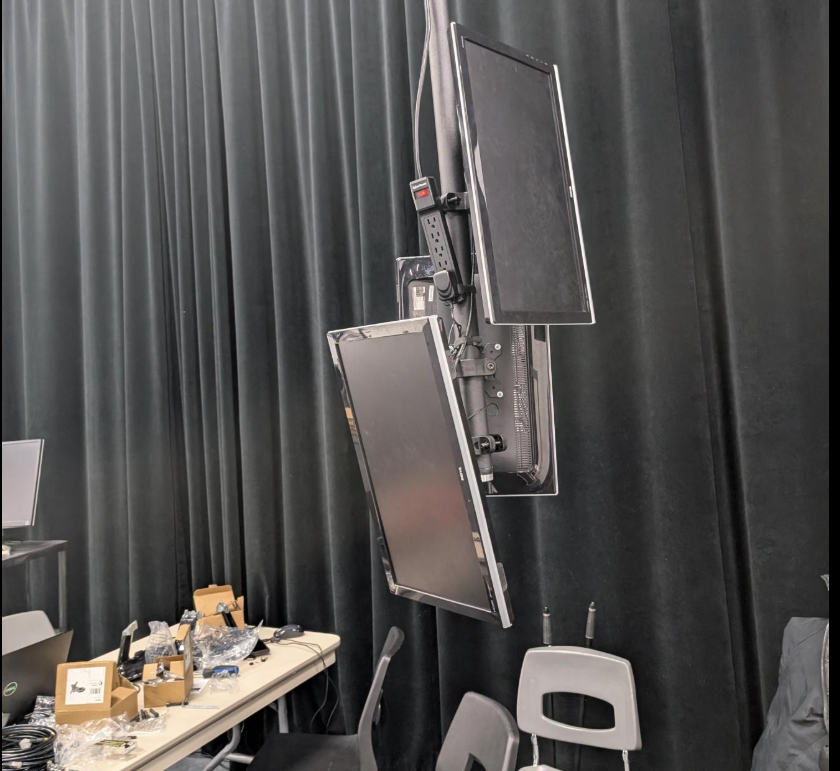

# Exposition des finissants
Dans ce fichier, je vais parler des expositions que j'ai pris en note durant l'exposition Resonance.

## InterNature 

### Internature, l'équipe et l'Oeuvre
Intern est une expérience interactive où le mouvement d’une sphère lumineuse transforme un environnement numérique en perpétuelle évolution.

### L'éxperience

En entrant, une ambiance sonore et une sphère illuminée attirent l’attention.En tournant la sphère, des vignes et des fleurs numériques poussent sur les côter.Une fois les murs recouverts, les fleurs deviennent interactives : en les touchant, leurs pétales s’éparpillent.

Si le mouvement cesse, la végétation se rétracte, et l’expérience peut être recommencée.Il y a l'interactivité avec la sphère et la transformation progressive du tunnel qui captivent l’attention, créant une expérience immersive.

### Installation 

### cours nécessaire pour réalisation du projet
traitement audiovisuel , Audio 2 , Objets Interactif , web 4
### Technique technologique avancée , le Mapping
Le mapping vidéo (ou projection mapping) consiste à projeter des visuels sur des objets 3D (murs, sculptures, tunnels) pour transformer leur apparence en temps réel. L’ajout de capteurs de mouvement permet de rendre ces projections interactives : les éléments réagissent aux gestes du spectateur, créant une expérience immersive et dynamique.
#### source 
<https://tprangers.github.io/internature/#/> 

## Étheria

### Étheria, l'équipe et l'Oeuvre
Etheria est un jeu interactif en pixel art basé sur la défense de la Pierre des Tera contre des vagues d'ennemis.

### L'éxpérience
L’aspect multijoueur et stratégique soulève des attentes sur la communication entre joueurs. La difficulté croissante et les vagues d’ennemis ajoutent du stress positif, renforçant l’envie de rejouer. Une expérience dynamique et engageante, en se posant aussi des questions comme : Comment la détection des pions fonctionne-t-elle ? Le jeu sera-t-il réactif et fluide ? La technique de l’usage de figurines physiques pour influencer l’univers numérique aussi ammène de la curiausitée au jouer.

### Installation 

### cours nécessaire pour réalisation du projet
Interactivité ludique, Instalation multimédia , Objet Interactifs
### Technique technologique avancée , la réalité augmentée
La Réalité Augmentée superpose des éléments virtuels (images, objets 3D, informations) à l’environnement réel en temps réel. Dans Etheria, une webcam est utilisée pour détecter les pions placés sur la table, intégrant les mouvements des joueurs dans un monde numérique projeté. Cette interaction fluide entre les objets physiques et les projections numériques est un exemple classique de RA appliquée dans les jeux.
#### source
<https://ethereal-creators.github.io/Etheria/#/>

## Fuga

### Fuga, l'équipe et l'Oeuvre
Fuga est un projet interactif visant à générer des arbres personnalisés en fonction du son créé par l’utilisateur. Ce projet met en scène un groupe de scientifiques qui ont conçu une plante sensible aux fréquences sonores et aux vibrations pour sauver la planète de l’industrialisation.

### L'éxperience
L'idée d'un générateur d'arbres interactif réagissant au son semble originale. La combinaison de nature et technologie dans un environnement sonore m'intéresse particulièrement.Pouvoir voir un arbre se développer et changer en fonction de mes actions est fascinant. La personnalisation sonore ajoute une couche unique à l’expérience , aussi l'accisibilitée pour de 3 personnes et plus est un concept unissant.

### L'Installation

### cours nécessaire pour réalisation du projet
Audio 2 , web (4-5), Préparation au milieu de travail ( je pense que la majoritée des cours des session 4-5 sont importants)
### Technique technologique avancée , la synthèse sonore interactive 
La synthèse sonore interactive consiste à utiliser un synthétiseur ou un autre dispositif audio pour générer des sons qui modifient des éléments visuels en temps réel. Dans Fuga, cette technique permet à l’interacteur de contrôler la croissance et la forme de l’arbre en fonction des sons qu’il génère, en jouant sur les fréquences, les tonalités et les effets.
#### source
<https://escapism-fuga.github.io/Fuga/#/>
## Prismatica

### Prismatica, l'équipe et l'Oeuvre
Prismatica est un projet interactif qui explore la relation entre le dessin et le son en s'inspirant de la synesthésie (perception croisée des sens, comme voir des sons). Le projet utilise le cercle chromatique de Newton, qui associe chaque couleur à une fréquence sonore, pour créer une expérience immersive où les couleurs dessinées produisent des sons correspondants.

### L'éxperience
Expérience immersive et surprenante. Chaque trait devient vivant à travers le son et l’image. Sensation de fusion entre l’art et la technologie, où chaque geste crée une œuvre unique et évolutive. Chaque couleur produit un son diffèrent dépendamment où l'utulisateur dessine. Le bruit change  aussi dépendamment de la quantité de couleur présente sur le tableau.

### L'Installation

