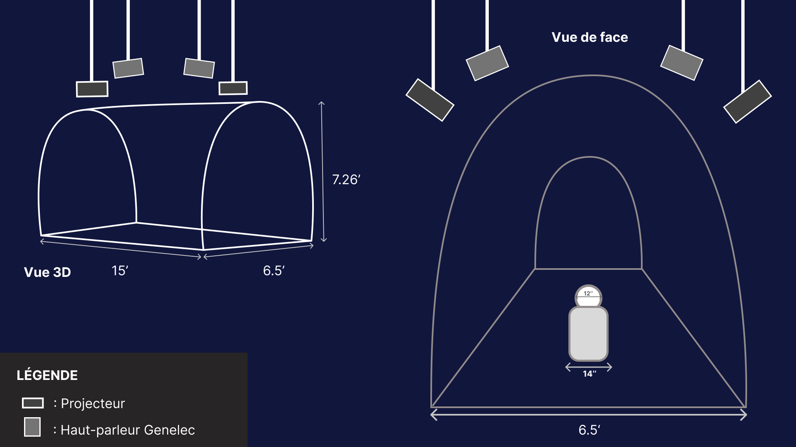

# Exposition des finissants
Dans ce fichier, je vais parler des expositions que j'ai pris en note durant l'exposition Resonance.

## InterNature 

### Internature, l'équipe et l'oeuvre
Intern est une expérience interactive où le mouvement d’une sphère lumineuse transforme un environnement numérique en perpétuelle évolution.

### L'éxperience

En entrant, une ambiance sonore et une sphère illuminée attirent l’attention.En tournant la sphère, des vignes et des fleurs numériques poussent sur les côter.Une fois les murs recouverts, les fleurs deviennent interactives : en les touchant, leurs pétales s’éparpillent.

Si le mouvement cesse, la végétation se rétracte, et l’expérience peut être recommencée.Il y a l'interactivité avec la sphère et la transformation progressive du tunnel qui captivent l’attention, créant une expérience immersive.

### Installation finale

### cours nécessaires pour réalisation du projet
traitement audiovisuel , Audio 2 , Objets Interactif , web 4
### Technique technologique avancée , le Mapping
Le mapping vidéo (ou projection mapping) consiste à projeter des visuels sur des objets 3D (murs, sculptures, tunnels) pour transformer leur apparence en temps réel. L’ajout de capteurs de mouvement permet de rendre ces projections interactives : les éléments réagissent aux gestes du spectateur, créant une expérience immersive et dynamique.
#### source : https://tprangers.github.io/internature/#/ 

## Étheria

### Étheria, l'équipe et l'oeuvre
Etheria est un jeu interactif en pixel art basé sur la défense de la Pierre des Tera contre des vagues d'ennemis.

