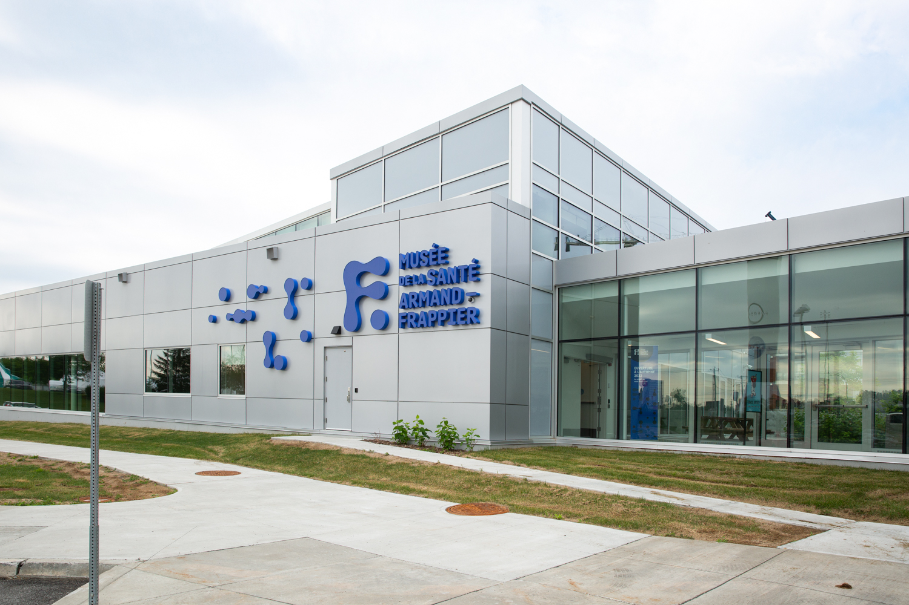
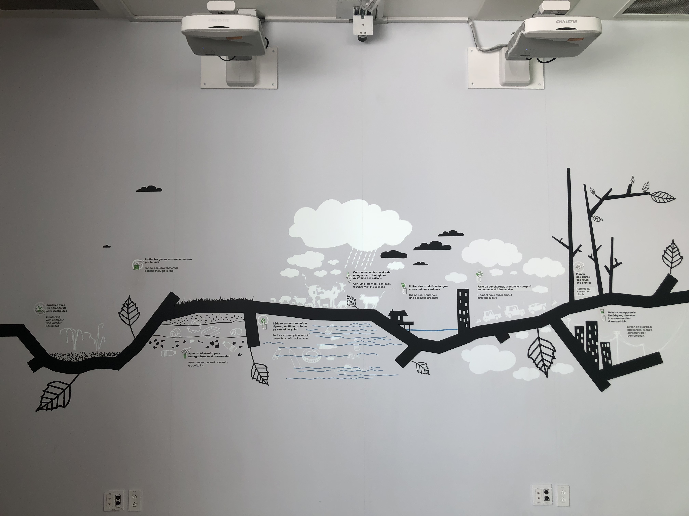
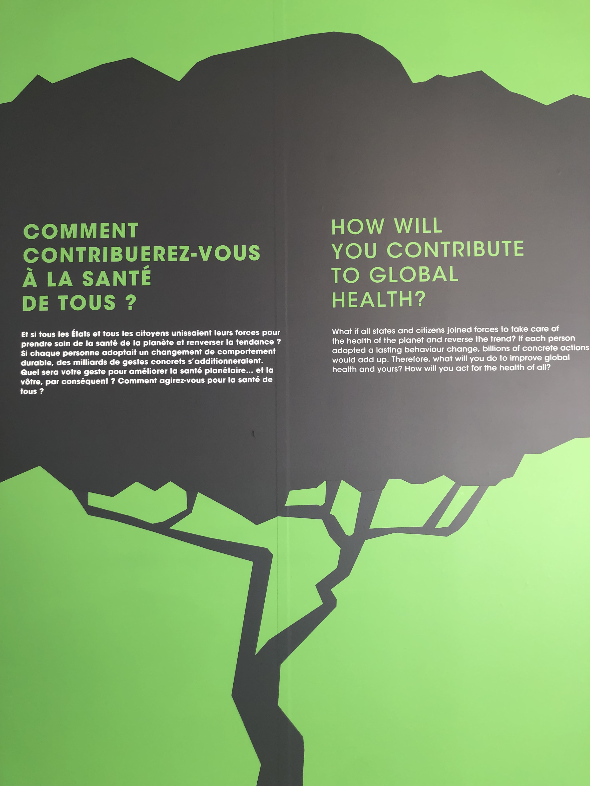
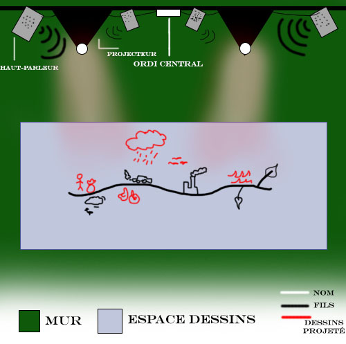
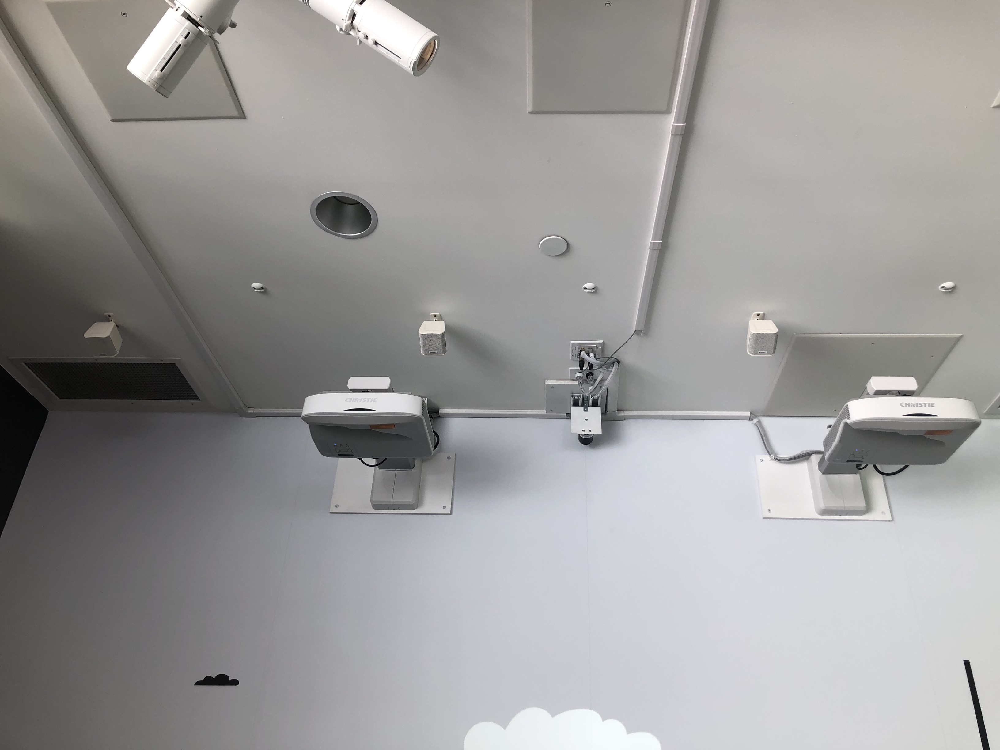

# Musée de la santé Armand-Frappier

*credit de la photo: museefrappier.org*
## Ma visite
Le 21 février 2025, j'ai visitée l'exposition permanente du Musée : 4, 3, 2, 1… Santé! Cette exposition à commencer du 31 janvier 2023 et dureras j'usqu'au 31 août 2033. Un aspect que j'apprécie c'est que l'exposition ne vise pas un groupe d'age nécessaire, un enfant qui à 7 ans peut s'amuser à découvrir les oeuvres tout come moi, une adolescente de 17 ans. Le temps que j'ai pris pour visualiser chaque oeuvre était d'environ 45 - 50 minutes. Il y avait des oeuvres multimédiatiques que j'ai trouvé assez intéréssants, mais ils n'étaient pas vraiment intéractif. L'Oeuvre que je vous présente n'a malheureusement pas de nom. Après des recherches Intensives je n'ai pas pu trouver autre que les créateurs de l'oeuvre et de l'exposition, n'empêche que je vais l'expliquer.

*photo prise par moi lors de ma visite*
## 4, 3, 2, 1... Santé!
Illustrée par Laurent Pinabel, avec des animations de Carine Khalife, cette oeuvre visuelle et interactive s’étale horizontalement sur un mur, sous deux projecteurs. Elle représente une ligne noire continue stylisée, semblable à une branche ou une veine, traversant divers environnements. Elle illustre l’interdépendance entre l’environnement naturel, les milieux urbains, les actions humaines et leurs impacts sur la santé. Elle vise à sensibiliser les visiteurs à l’effet de nos modes de vie sur la santé humaine et celle de la planète. L’œuvre met en lumière les liens entre environnement, urbanisation, et santé publique, tout en offrant des pistes d’action accessibles.

## L'Éxpérience vécue
Dès qu’on entre dans la salle, deux projecteurs diffusent une fresque animée sur un mur pâle. On remarque d’abord le style simple et graphique de l’illustration : une grande ligne noire traverse le mur, comme une racine ou une artère. Elle se déploie dans plusieurs directions, reliant des scènes de nature, de ville, d’eau et de pollution. Tout autour, des animations s’activent doucement : la pluie tombe, des feuilles bougent, l’eau ondule, les camions circulent.Le rythme lent des projections invite à l’observation.On se surprend à suivre la ligne comme un parcours, à lire les courts textes (en français et en anglais), à réfléchir aux gestes quotidiens évoqués : trier ses déchets, protéger la nature, consommer autrement.

Petit à petit, on comprend que tout est connecté : ce qu’on jette, ce qu’on mange, comment on se déplace… tout a un impact sur notre santé et celle de la planète. Ce lien devient clair grâce à l’animation fluide et à la simplicité des images.

## Technologie et Multimédia

*Croquis de l'oeuvre*
Deux projecteurs à courte focale sont installés au plafond, juste au-dessus de l’œuvre. Ils projettent directement sur le mur, sans ombre ni déformation, ce qui permet une intégration fluide des animations à l’illustration murale.Le contenu animé a été réalisé par Carine Khalife, une illustratrice et animatrice. Son style est organique et fluide, en parfaite harmonie avec les dessins fixes de Laurent Pinabel, l’illustrateur.

Les animations sont :des gouttes de pluie tombent et pénètrent le sol ; des nuages passent lentement dans le ciel ; des camions avancent en silence sur les routes ; l’eau bouge doucement, simulant le courant ; des feuilles tombent ou frémissent, animant les arbres stylisés. Il y a des haut-parleurs mais il n'y a pas de grands bruits, plutot une ambiance douce. Bref, Le choix du multimédia permet de :
animer le savoir scientifique sans surcharge ;
captiver l’attention des enfants comme des adultes ;
créer un lien émotionnel avec des thématiques environnementales.

## Les Artistes
###  Laurent Pinabel – Illustrateur et concepteur graphique
Laurent Pinabel est un illustrateur et designer graphique français installé à Montréal. Il se distingue par un style graphique épuré, symbolique et narratif, souvent inspiré par la nature, la science et la société.Il collabore régulièrement avec des institutions culturelles et muséales, notamment pour des expositions éducatives.Son travail se caractérise par une volonté de rendre l’information accessible visuellement, avec des illustrations claires, poétiques et signifiantes.Il a aussi enseigné à l’Université du Québec à Montréal (UQAM), dans le domaine du design graphique.

### Carine Khalife – Illustratrice et animatrice
Carine Khalife est une artiste multidisciplinaire, née à Paris et basée à Montréal. Elle travaille comme illustratrice, animatrice et réalisatrice.Son style est onirique et fluide, mêlant peinture, textures naturelles et animation image par image.Elle a réalisé des clips musicaux, des courts-métrages, ainsi que des animations pour des expositions et des installations multimédia.Carine cherche à créer une émotion visuelle, en explorant la matière, le mouvement et la sensibilité humaine.Son univers est souvent qualifié de poétique et sensoriel.
*Voir dans le dossier Media, les credits*
## Éléments Apprécié
Personnellement, l'experience est unique. Le message derrière l'oeuvre est très touchante. Mettre en valeur le cycle de pollutiom, de manière visuelle, pour sensibiliser les jeunes vient me toucher. Tout aussi, le musée est la création de Armand-Frappier, un grand scientifique et génie qui est très connu au Québec. C'est grâce à lui que le musée est fondée.

## Éléments plus ou moins apprécié
Premièrement, je pense que pour un étudiant en TIM (Technique d'Intégration Multimédia), l'exposition est pas assez complexe. En tant qu'étudiante j'aurais préférée que le mur soit intéractif ou que le concept était différent. Par exemple, que l'utulisateur puisse faire des choix et des animations apparaisent qui reflétent les conséquences soit positive ou négative. C'est mon opinion mais la technique m'a unpeu déçu. Sinon, je trouve que pour un enfant ou un adulte qui ne sont pas très intéréssés par la technique mais plutot au résultat, ca reste agréable.

## Sources
<https://museefrappier.org> / <https://www.tourismelaval.com> / <https://www.facebook.com/cadabracreation> / <https://www.pinabel-illustrations.com> / <https://www.behance.net/laurentpinabel> /
<https://www.carinekhalife.com> / <https://www.lapresse.ca/arts> / <https://www.montrealpourenfants.com> 
