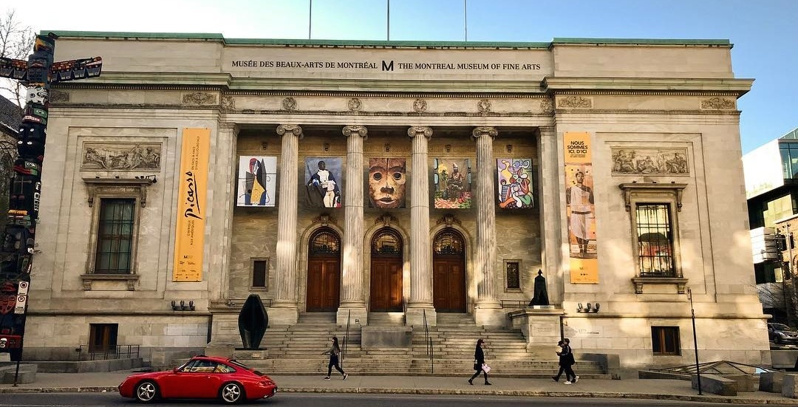
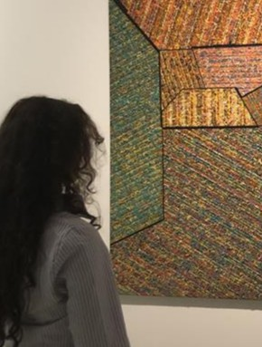
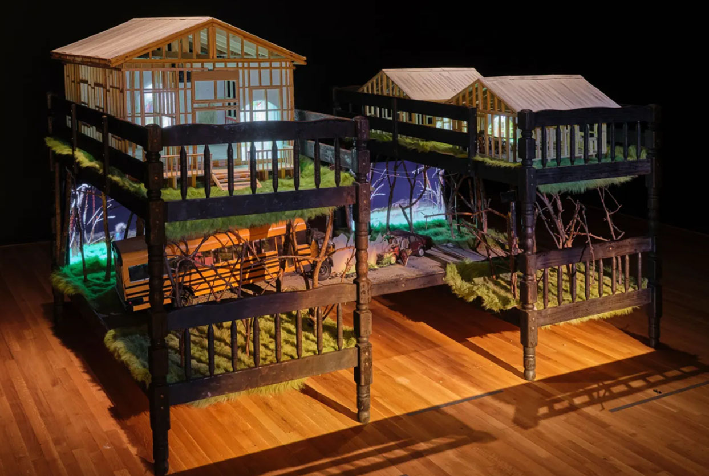
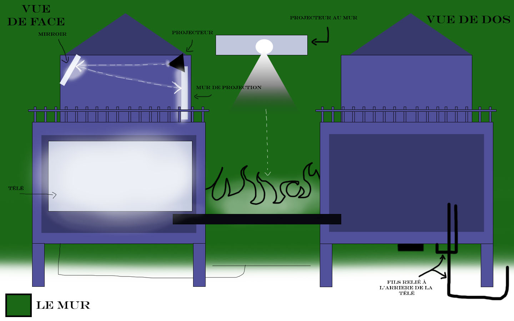

# Visite du Musée des beaux-arts de Montréal

*photo prise enligne source: ar.inspiredpencil.com*
## Ma visite
Le 4 avril 2025, j'ai visité le musée des beaux-arts de Montréal.Le musée n'avait malheureusement pas beaucoup d'œuvre multimédia mais il y en avait au moins deux grandes œuvres. ***Ravel Ravel Interval*** par Anri Sala est une pièce qui montre une des projections différentes de deux pianistes jouant le même morceau : le Concerto pour la main gauche de Maurice Ravel.Mais chacun le joue à un tempo légèrement différent. Les deux vidéos sont projetées côte à côte, et cette dé-synchronisation volontaire crée une expérience étrange : parfois harmonieuse, parfois déstabilisante. C'est une œuvre temporaire Immersive qui est présente au musée du 29 novembre 2024 au 27 avril 2025. Celle-ci est l'une des œuvres Multimédiatique présentée au musée, la deuxième est celle qui m'a intéréssée le plus. Le nom de l'œuvre est ***Camp Wakanda*** par Graeme Patterson.

*photo de moi devant une œuvre au musée*
## Camp Wakanda
"Camp Wakonda" est une installation immersive créée en 2010 par l’artiste canadien Graeme Patterson, connu pour son travail en animation stop-motion, sculpture, maquette et installation.C'est une exposition permanente.L’œuvre prend la forme d’une grande maquette interactive, semblable à une boîte ou un diorama géant. Elle représente un paysage de camp d'été / forêt/ cabanes/ lacs dans une version miniature, détaillée et un peu fantastique.

À l'intérieur, des mécanismes motorisés donnent vie aux scènes : des personnages en mouvement, des lumières qui s’allument, des sons ambiants de la nature, ou des extraits audio narratifs. Le tout est orchestré avec une précision cinématographique, souvent accompagnée de séquences en stop-motion projetées ou visibles à travers des hublots, comme si l’on regardait un souvenir figé dans le temps.

### Le sujet et l'éxperience
Le sujet de l’exposition tourne autour de la mémoire personnelle, de l’enfance, et de la reconstruction poétique du passé. D'explorer la mémoire et les souvenirs d’enfance à travers une installation multimédia mêlant maquette, animation et son. L’artiste revisite un camp d’été de son passé, non pas pour documenter, mais pour réinterpréter émotionnellement cette période.
*voir le cartel dans le dossier media*
Le but principal de l'oeuvre étant Faire ressentir la mémoire comme une expérience sensorielle, immersive et émotionnelle.  L’œuvre parle d’un souvenir personnel, mais chacun peut y projeter ses propres souvenirs. On ne regarde pas seulement une œuvre : on entre dans un univers mental, comme un rêve.
#### l'éxperience
Lorsqu’un visiteur entre dans l’espace d’exposition de Camp Wakonda, il est d’abord frappé par l’ambiance immersive : lumière tamisée, sons discrets de la nature, et une structure centrale qui attire immédiatement l’attention.
Le spectateur est invité à circuler autour de l’installation sans interaction tactile. Il observe la maquette de près, découvre des fenêtres ou écrans intégrés qui diffusent des scènes animées (stop-motion), et perçoit des éléments en mouvement.

## Technologie et Multimédia
 
*Un croquis technique de l'œuvre*
**Composantes** : Maquette miniature/Objets motorisés ,Certains éléments bougent : personnages, lumières, structures./ Éléments visuels animé , Séquences en stop-motion / Système sonore / Éclairage intégré / Dispositifs de vision (Fenêtres ou écrans ) 
**Techniques** :  Animation en stop-motion/ Sculpture ,modélisme / Mécanismes motorisés / Design sonore / Installation spatiale. 
À l'aide de plusieurs recherches, j'ai été capable de déterminer chaque composantes nécessaires pour la réalisation de l'oeuvre.

•	Socle robuste pour supporter la maquette (poids + stabilité)
•	Caisson fermé ou structure vitrée (selon la version), pour protéger l’œuvre
•	Cache-fils pour dissimuler les branchements visibles
•	Herses (barres suspendues au plafond) pour suspendre l’éclairage directionnel
•	Projecteurs LED orientés sur des zones précises de la maquette
•	Éclairage intégré dans l’œuvre (petites lampes ou LED dans la maquette)
•	Multiprises et câbles électriques pour alimenter :
→ les moteurs, les animations, le son, les écrans
•	Boîtiers de contrôle ou interfaces informatiques (pour l’animation vidéo)
•	Système audio discret (haut-parleurs cachés dans l’installation ou la salle)
•	Barrières basses ou marquages au sol pour délimiter l’espace d’observation
Pour un visuel , voir le dossier Media.

## Éléments appréciés
Tout d’abord, l’expérience peut sembler adorable. Les deux cabanes, chacune avec un deuxième étage, m’ont rappelé les maisons de poupées. Les projecteurs, qui semblent être en petit format, me donnent l’impression que cette exposition reflète un petit univers.
Chaque animation en stop motion correspond au décor de cette maison. J’aime bien cela, et je trouve que l’artiste réussit à refléter son idée.
Les couleurs et le décor sont les aspects qui m’attirent le plus.

## Éléments plus ou moins appréciés
En général, l’expérience m’a plu, sauf pour quelques détails. Le son émis par chaque animation me rend confus·e. Il y a tellement de bruits qui se produisent en même temps que j’ai un peu de difficulté à me concentrer sur une seule.
Un deuxième élément concerne les nombreuses petites barrières au deuxième étage des cabanes. Il y a beaucoup trop de morceaux de bois et, considérant qu’il y a une limite inscrite au sol, il est difficile de s’approcher pour bien voir les animations du haut.
Il me semble aussi que, selon la taille de la personne, si elle souhaite voir ce qui est projeté en hauteur mais n’est pas assez grande, ce facteur peut gâcher un peu l’expérience.
Sinon, c’est une exposition réussie !

sources :
<https://www.graemepatterson.com/Camp%20Wakonda.htm> , <https://galerie.uqam.ca/en/expositions/graeme-patterson-secret-citadel> , <https://confederationcentre.com/exhibition/graeme-patterson-secret-citadel> , <https://www.gallerieswest.ca/magazine/stories/graeme-patterson/>
