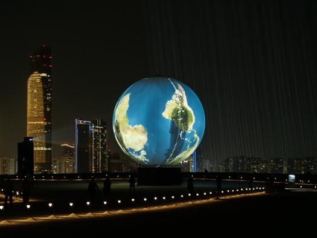

#  Créer et Exposer des Œuvres d'Art Contemporain : Un Voyage Technique et Artistique

## Intro

Pendant la conférence, l’intervenant nous a expliqué comment se passe la création, l’installation et l’exposition d’œuvres d’art contemporain. L’artiste principal, Raphaël, a partagé son expérience à travers des projets ambitieux, comme Sphere Packing Bach et d'autres œuvres expérimentales. Il a aussi parlé des défis techniques et logistiques qu’il a rencontrés. L’exposé montrait surtout comment l’artiste imagine ses œuvres, comment elles sont installées, et quel impact elles peuvent avoir sur le public.

## Contenu de la conférence
Une idée importante abordée était l’importance de la réflexion avant la création. Pour Raphaël, ce qui compte le plus, c’est l’émotion ressentie par les visiteurs, plus que la technique pure. Son œuvre Sphere Packing Bach en est un bon exemple : c’est une installation avec 1158 haut-parleurs qui représentent les compositions de Bach. Elle transforme la musique en une expérience immersive, mélangeant son, espace et émotions.

Un autre point essentiel concernait la logistique compliquée autour des œuvres. Transporter, installer et exposer une œuvre demande une organisation très précise. Par exemple, pour Sphere Packing Bach, chaque câble devait être numéroté et relié à un haut-parleur et un ordinateur précis. Cette organisation est super importante pour que l’œuvre fonctionne correctement. Dans d’autres projets, comme une énorme installation sur une île à Abu Dhabi, Raphaël a aussi dû faire face à des problèmes liés au vent, au sable et à la chaleur.

## En conclusion..

La conférence nous a vraiment permis de découvrir l’univers technique et artistique derrière les œuvres d’art contemporain. L’intervenant a montré que l’art, ce n’est pas seulement créer des œuvres visuelles, mais aussi gérer toute une partie logistique très compliquée. Ce qui m’a marqué, c’est de voir tous les efforts invisibles qu’il faut faire pour qu’une œuvre soit réussie et accessible au public. Les projets présentés montrent que, malgré les difficultés techniques, l’artiste cherche toujours à offrir la meilleure expérience possible.

Voici une des œuvres dont j'ai trouvé le concept et la fabrication intéressants.
*credit : Rafael Lozano-Hemmer, "Shadow Tuner", 2023.*  *Photo prise par:  Lance Gerber.* *Lieu :  Abu Dhabi, United Arab Emirates, 2023.*
Ressources : <https://www.lozano-hemmer.com/showimage_emb.php?proj=shadow_tuner&img=abu_dhabi_2023&idproj=410&type=artwork&id=5>
<https://www.lozano-hemmer.com/shadow_tuner.php>
